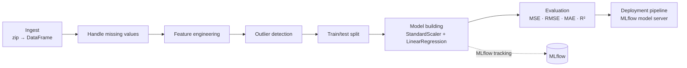

# House Price Prediction: an MLOps Pipeline with ZenML and MLflow

An end-to-end machine learning pipeline that predicts house sale prices from the [Ames Housing dataset](https://www.kaggle.com/datasets/prevek18/ames-housing-dataset). The focus is on **engineering the workflow** rather than the model itself: modular pipeline steps orchestrated by **ZenML**, experiments and models tracked with **MLflow**, a deployable prediction service, and code organised around classic design patterns (Strategy, Factory, Template Method).

## Pipeline



Each box is a ZenML step in [`steps/`](steps). The logic behind each step is in [`src/`](src) and is implemented as a swappable **strategy**, so you can change the imputation method, feature transform or model without touching the pipeline.

## Project structure

```
├── analysis/            EDA notebook + reusable analysis modules (univariate, bivariate, multivariate, missing values)
├── src/                 core logic: ingestion, missing values, feature engineering, outliers, splitting, model building, evaluation
├── steps/               ZenML step wrappers around src/ + prediction service loader
├── pipelines/           training_pipeline.py and deployment_pipeline.py
├── explanations/        small standalone examples of the Strategy, Factory and Template design patterns
├── data/                raw dataset archive
├── run_pipeline.py      run the training pipeline
├── run_deployment.py    run the continuous deployment pipeline
└── sample_predict.py    send a sample request to the deployed model
```

## Getting started

**Requirements:** Python 3.8+.

```bash
git clone https://github.com/Madhavyamjala/house-price-prediction-p.git
cd house-price-prediction-p

python -m venv venv
# Windows: venv\Scripts\activate    Linux/macOS: source venv/bin/activate

pip install -r requirements.txt
zenml integration install mlflow -y
```

Register a ZenML stack that uses MLflow for experiment tracking and model deployment:

```bash
zenml experiment-tracker register mlflow_tracker --flavor=mlflow
zenml model-deployer register mlflow --flavor=mlflow
zenml stack register local-mlflow-stack -a default -o default -d mlflow -e mlflow_tracker --set
```

Then train, deploy and query the model:

```bash
python run_pipeline.py      # train + log to MLflow
mlflow ui                   # inspect runs at http://localhost:5000
python run_deployment.py    # deploy the model as a local prediction server
python sample_predict.py    # send a sample prediction request
```

## Design patterns

The [`explanations/`](explanations) folder has minimal examples of each pattern used in the pipeline:

- **Strategy:** interchangeable algorithms for imputation, feature engineering, outlier handling and model building.
- **Factory:** creates the right data ingestor for a given file type.
- **Template Method:** a fixed analysis flow with overridable steps for EDA.

## Tech stack

Python · pandas · scikit-learn · ZenML · MLflow · matplotlib / seaborn · statsmodels

## Roadmap

- Stronger models (gradient boosting, regularised regression) compared side by side in MLflow
- Unit tests for the `src/` strategies
- CI with GitHub Actions

## License

MIT. See [LICENSE](LICENSE).
